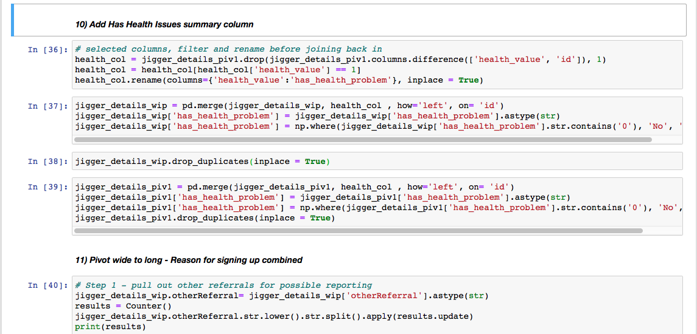
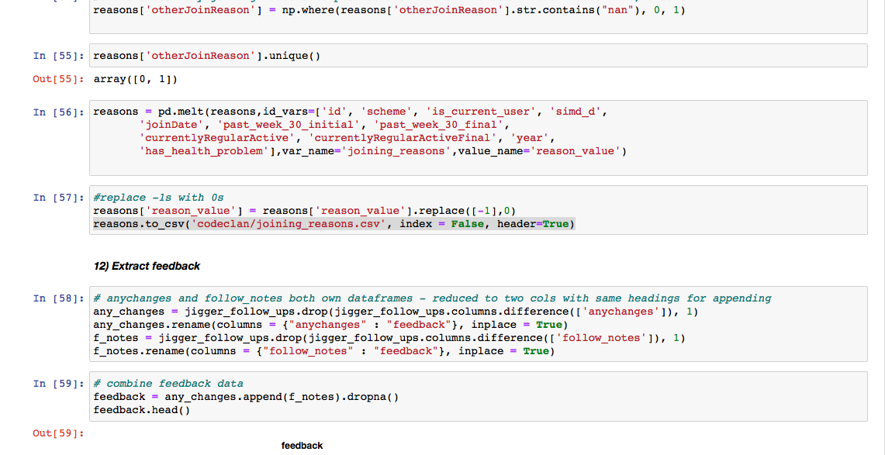
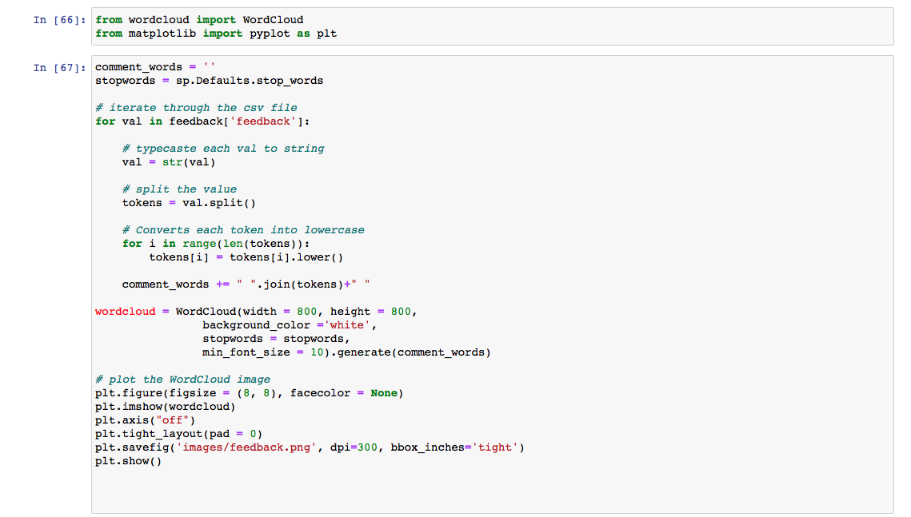
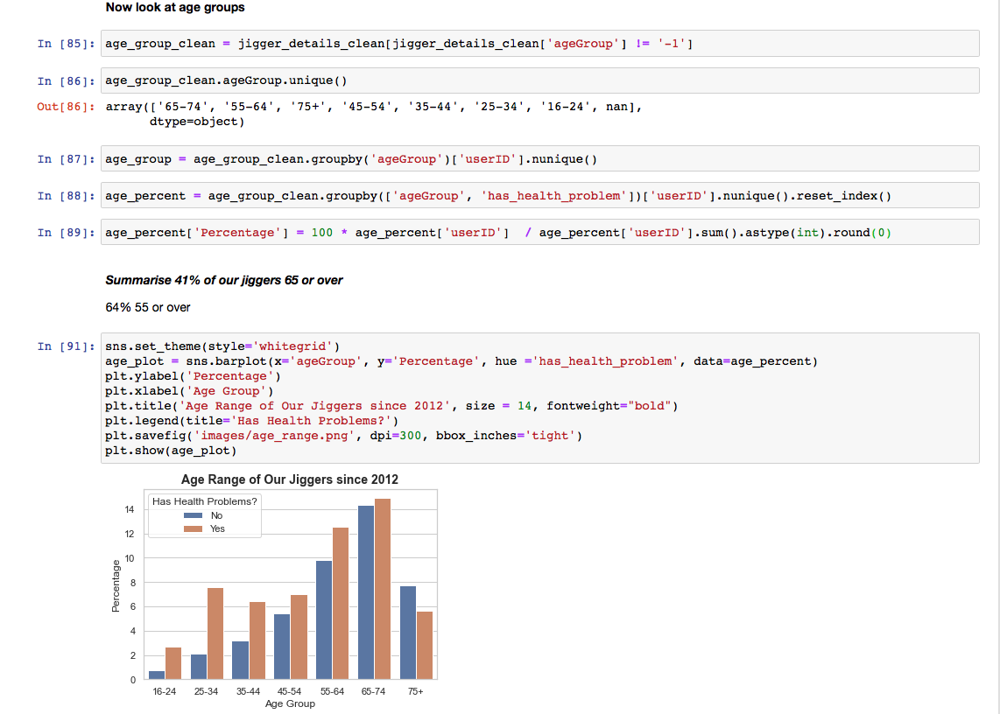
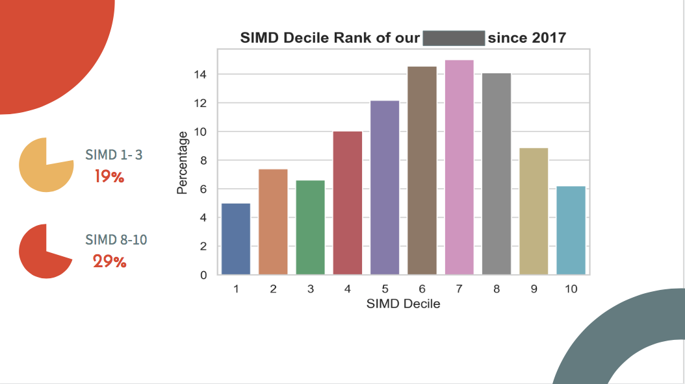
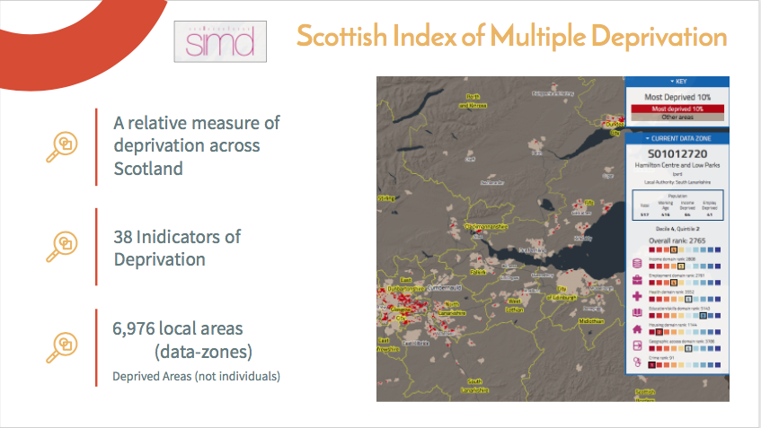

# Python Data Analysis Project

### 2 Week Individual Project (CodeClan Data Analysis Course Final Project)

#### Data Analyis for a Scottish Charity
###### All reference to the charity has been removed
Our user description was changed to "jiggers" - the original was not "joggers"!! :-)

This was a real-life project for a Scottish charity who had given me access to their data to gain an understanding of trends, correlations and project successes/failures, to help with strategic planning.  At the end of the 2-week project, and for which I conducted my work solely in Python, I made a non-technical presentation to the charity and my peers providing visualisation, analysis and insight from my findings.  The charity welcomed the visualisations provided and requested a copy of my presentation.

To showcase my ability to adapt and learn new technology I carried the whole project out using Python ( having only spent 3 days of the CodeClan course learning Python).

The project was for a Scottish Health Charity which is funded with the purpose of getting the inactive population more active.  A survey is completed by charity users initially and as a 6 month follow up.  I was provided with 7 data sets plus I accessed external govt data for Scotland wide data comparisons.  I used the data to provide analysis on the demographics, and the change in activity levels of users overall and by Scottish Deprivation Ranking (SIMD).

###### Process
I was given a written brief and access to the data.  After fully reading the brief, I explored the data (and how the datasets connected) and made a rough plan of the intended outcome.  I then held a meeting with the Charity contact to discuss direction and gain clarification.  I was then able to finalise a plan of direction and started cleaning, wrangling and pulling together the data for my purposes .  Following completion of the cleaning I then conducted my analysis, visualisations and correlation analysis.  Code was commented throughout for my process understanding.  Contact was made with the charity a number of times to ensure I was on the correct path.  I presented my findings and visualisations to my CodeClan peers and the charity ( this was a layman's none technical presentation), which was highly received.

###### Highlights
1) There was a lot of optional and valuable user data which I did not want to loose which I managed to extract and pull in.
2) I’d done text mining with R but not Python - I reasearched and found NLTK and space packages which I incorporated to return most frequent words ( for teh charity user feedback) with stop words removed.
3) I made use of Panda pivoting and joining techniques, datetime, Matplotlib / Seaborn, Panda Profiling ... and lot's more

###### Personal code example 1
Wrangling & Joining

###### Personal code example 2
Wrangling and Pivoting

###### Personal code example 3 
Text Mining and a WordCloud

###### Personal code example 4
Wrangling and Plotting with Seaborn

###### Presentation slide example 1

###### Presentation slide example 2

